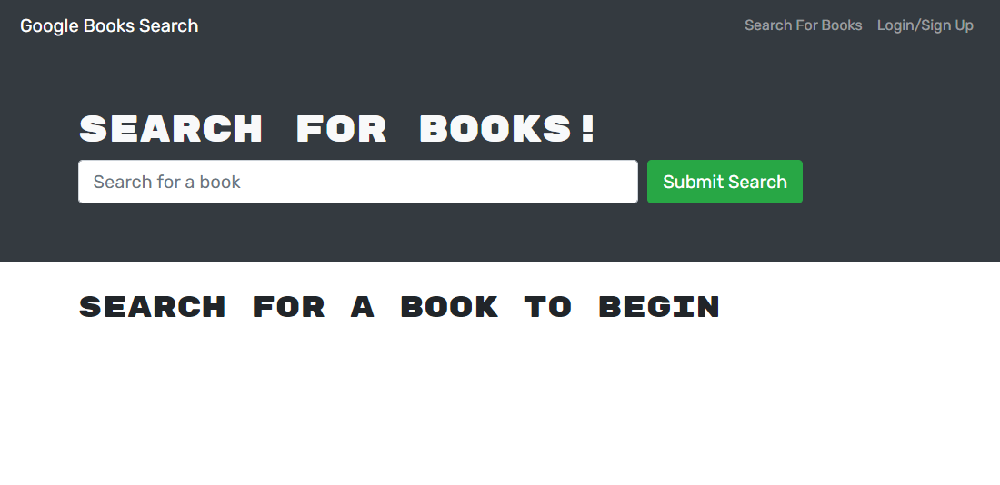

# Book Search Engine

## Description

Refactoring a fully functioning Google Books API search engine built with a RESTful API to use GraphQL API built with Apollo Server. The app was built using the MERN stack with a React front end, MongoDB database, and Node.js/Express.js server and API. It's already set up to allow users to save book searches to the back end. 

## Table of Contents
* [Description](#description)
* [Installation](#installation)
* [Usage](#usage)
* [Documentation](#documentation)
* [Questions](#questions)

## Installation

To install necessary dependencies, run the following command:

```
npm i
```

## Usage

Clone the repo, navigate to the root folder, run the following commands from the CLI:

Start Server;     
`npm start`    

## Documentation
Deployed application can be found [here](https://powerful-hollows-53265.herokuapp.com/).
The following picture is the screenshot of the application: 

 


## Questions
If you have any questions about this projects, please contact me at test@test.com or more projects on [Github](https://github.com/begirlz)

## Mock-Up

Let's start by revisiting the web application's appearance and functionality.

As you can see in the following animation, a user can type a search term (in this case, "star wars") in a search box and the results appear:


The user can save books by clicking "Save This Book!" under each search result, as shown in the following animation:


A user can view their saved books on a separate page, as shown in the following animation:


